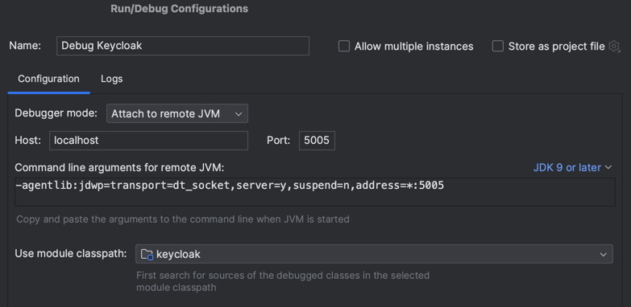

# Keycloak Dynamic Client Registration

This project contains a PoC code base for a Keycloak setup which dynamically creates clients if they do not yet exist. This is achieved through custom [Service Provider Interfaces](https://www.keycloak.org/docs/latest/server_development/#_providers), which can be found in the keycloak package. These providers are registered in Keycloak via the files in the resources folder.

## Development

### Building steps

Run this in the root directory
```
mvn clean package
```

then execute
```
docker compose build
```

### Running the application

Once the Maven build has completed successfully, you can start the necessary Docker
containers from the docker compose file.

```
docker compose up
```

Keycloak is available at http://localhost:8080.

To request a new token run the following command:

```bash
curl --location 'http://localhost:8080/realms/example/protocol/openid-connect/token' \
--header 'Content-Type: application/x-www-form-urlencoded' \
--data-urlencode 'grant_type=password' \
--data-urlencode 'username=test' \
--data-urlencode 'password=test' \
--data-urlencode 'client_id=unknown-client'
```

If the client does not exist yet, the response will be:

```json
{
    "error": "invalid_client",
    "error_description": "Invalid client or Invalid client credentials"
}
```

If the same request is executed again, the response will be:

 ```json
{
    "error": "unauthorized_client",
    "error_description": "Invalid client or Invalid client credentials"
}
 ```

Indicating that a client has been created (although not setup correctly).

### Debugging the application

Remote debugging is available on port `5005`. In IntelliJ you can configure the debugger as
follows:

